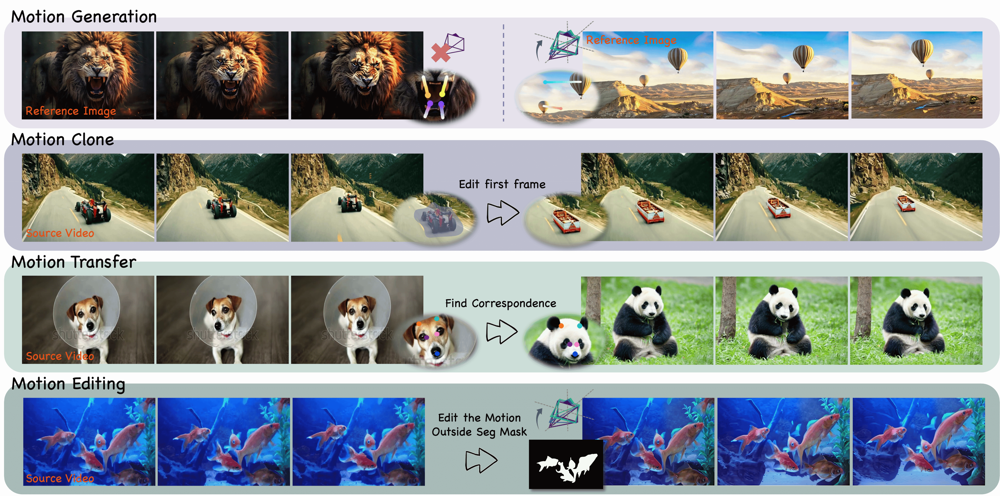

# Perception-as-Control
Official implementation of "Perception-as-Control: Fine-grained Controllable Image Animation with 3D-aware Motion Representation"

<p align="center">

</p>

### [Project page](https://chen-yingjie.github.io/projects/Perception-as-Control/index.html) | [Paper](https://arxiv.org/abs/2501.05020) | [Video](https://comming_soon) | [Online Demo](https://comming_soon)

**Perception-as-Control: Fine-grained Controllable Image Animation with 3D-aware Motion Representation**<br>
[Yingjie Chen](https://chen-yingjie.github.io/), 
[Yifang Men](https://menyifang.github.io/), 
[Yuan Yao](mailto:yaoy92@gmail.com), 
[Miaomiao Cui](mailto:miaomiao.cmm@alibaba-inc.com),
[Liefeng Bo](https://scholar.google.com/citations?user=FJwtMf0AAAAJ&hl=en)<br>

Motion-controllable image animation is a fundamental task with a wide range of potential applications. Recent works have made progress in controlling camera or object motion via the same 2D motion representations or different control signals, while they still struggle in supporting collaborative camera and object motion control with adaptive control granularity. To this end, we introduce 3D-aware motion representation and propose an image animation framework, called Perception-as-Control, to achieve fine-grained collaborative motion control. Specifically, we construct 3D-aware motion representation from a reference image, manipulate it based on interpreted user intentions, and perceive it from different viewpoints. In this way, camera and object motions are transformed into intuitive, consistent visual changes. Then, the proposed framework leverages the perception results as motion control signals, enabling it to support various motion-related video synthesis tasks in a unified and flexible way. Experiments demonstrate the superiority of the proposed method.

## Demo 

https://github.com/user-attachments/assets/1a11b5aa-4b36-4671-9beb-c7e9af634d36


https://github.com/user-attachments/assets/5d7852d8-e5d0-4307-be94-c5e29f00bb3d


https://github.com/user-attachments/assets/293a2255-5be5-487c-bd9e-22442cd21c80


https://github.com/user-attachments/assets/a4833c99-fc57-45b9-a99d-013fff8f647b


For more details, please refer to our [project page](https://chen-yingjie.github.io/projects/Perception-as-Control/index.html).


## Updates
(2025-01-09) The project page, demo video and technical report are released. The full paper version with more details is in process.


## Citation

If you find this code useful for your research, please use the following BibTeX entry.

```bibtex
@inproceedings{chen2025perception,
  title={Perception-as-Control: Fine-grained Controllable Image Animation with 3D-aware Motion Representation},
  author={Chen, Yingjie and Men, Yifang and Yao, Yuan and Cui, Miaomiao and Liefeng Bo},
  journal={arXiv preprint arXiv:2501.05020},
  website={https://chen-yingjie.github.io/projects/Perception-as-Control/index.html},
  year={2025}}
```